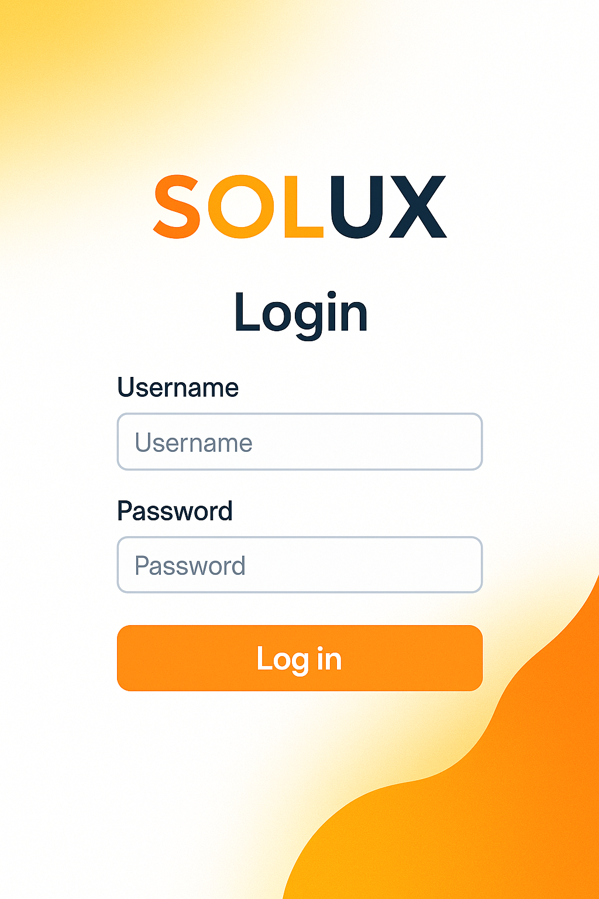
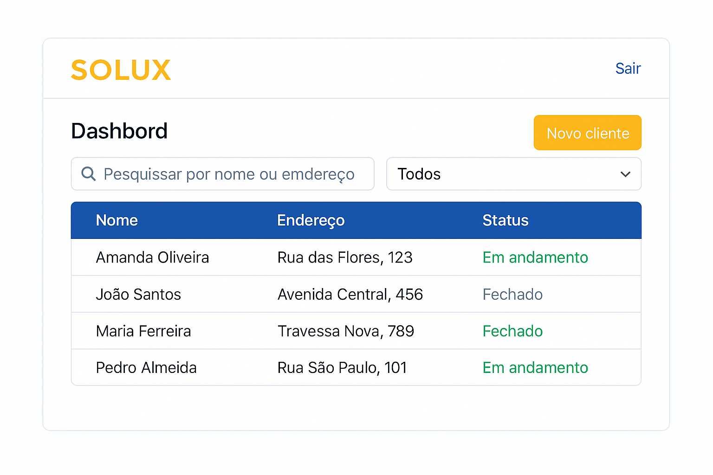
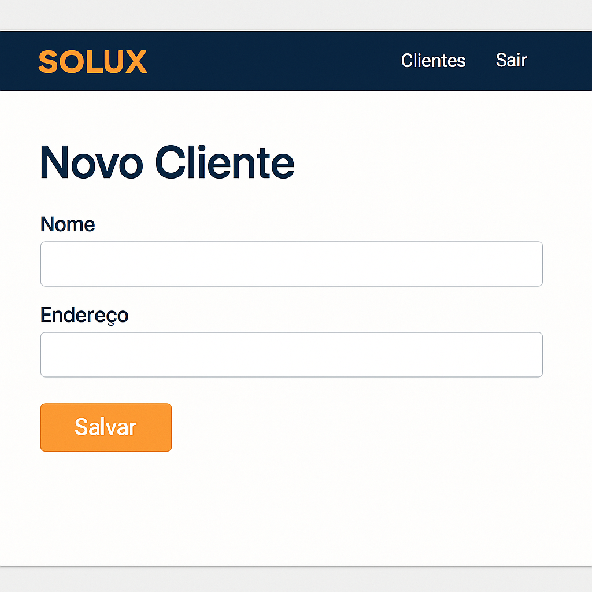
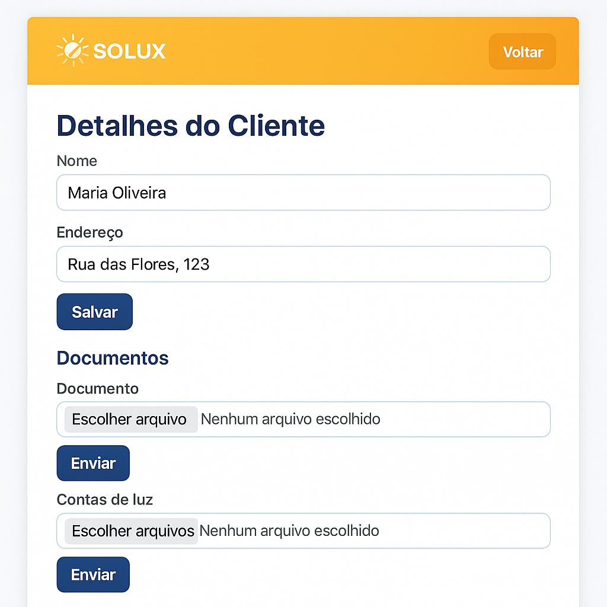
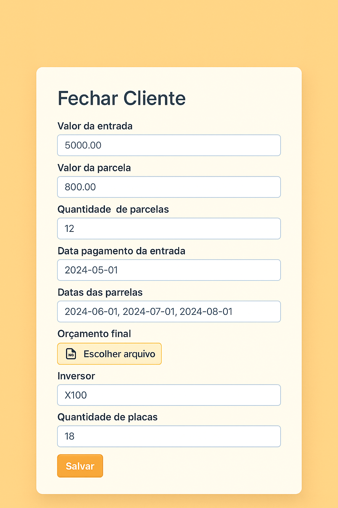
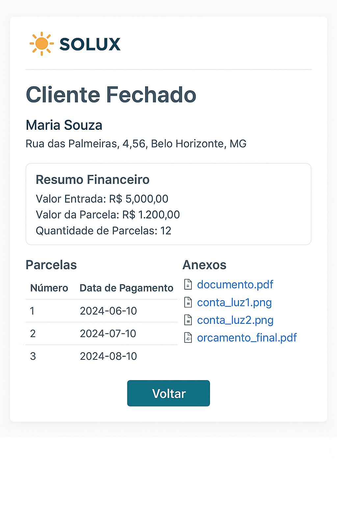

# SOLUX MVP – Cadastro de Clientes

Este projeto contém um MVP (Produto Mínimo Viável) de uma aplicação web para
cadastramento e gestão de clientes da **SOLUX**, uma empresa de energia solar.
O objetivo é demonstrar as funcionalidades básicas descritas no enunciado
utilizando apenas a biblioteca padrão do Python.  A aplicação implementa
back‑end, front‑end, banco de dados (SQLite) e armazenamento de arquivos de
forma simples, sem depender de frameworks ou serviços externos.

## Funcionalidades principais

* Login e autenticação de sessão com cookies (usuário e senha definidos em
  variáveis de ambiente).
* Cadastro de clientes com nome e endereço.
* Upload de contas de luz (imagens ou PDFs) enquanto o cliente está em andamento.
* Após o fechamento do cliente, é possível anexar o documento do cliente e
  o orçamento final opcionalmente, além de editar esses dados posteriormente.
* Listagem e edição de clientes enquanto estiverem em andamento.
* Mudança de status para **fechado**.  O formulário de fechamento permite
  informar valores financeiros (totais, custos, lucros, entrada, parcelas),
  datas de pagamento, informações do projeto, observação e anexar
  arquivos (documento do cliente e orçamento final).  Nenhum desses campos
  é obrigatório e podem ser editados posteriormente.
* Geração automática das parcelas conforme a quantidade e datas
  informadas.
* Visualização de todos os anexos de um cliente e download dos arquivos.
* Auditoria de ações (criação, atualização, upload, fechamento) com
  registro de quem executou a ação e quando.
* API REST simples que responde JSON quando a requisição possuir
  `Accept: application/json`.

## Estrutura do projeto

```
solux-mvp/
├── backend/
│   ├── server.py           # servidor HTTP com handlers para páginas e API
│   ├── solux.db            # banco de dados SQLite (criado automaticamente)
│   ├── uploads/            # pasta onde são salvos os arquivos enviados
│   └── templates/          # HTMLs usados pelo front‑end
├── README.md               # este documento
└── .env.example            # exemplo de configuração de variáveis de ambiente
```

## Requisitos

* Python 3.11 ou superior (já incluído neste ambiente).
* O servidor utiliza apenas módulos da biblioteca padrão, portanto não é
  necessário instalar dependências adicionais.

## Configuração

1. Copie `.env.example` para `.env` e ajuste as variáveis conforme
   necessário.  As principais variáveis são:

   * `PORT` – porta na qual o servidor irá escutar (padrão `8000`).
   * `SOLUX_ADMIN_USER` – usuário administrador para login (padrão `admin`).
   * `SOLUX_ADMIN_PASS_HASH` – hash SHA‑256 da senha do administrador.
     No exemplo é gerado para a senha `solux`.  Para gerar um novo hash
     execute:  
     `python3 -c "import hashlib; print(hashlib.sha256('sua_senha'.encode()).hexdigest())"`

2. (Opcional) Defina as variáveis de ambiente no shell antes de iniciar o
   servidor:

   ```bash
   export PORT=8000
   export SOLUX_ADMIN_USER=admin
   export SOLUX_ADMIN_PASS_HASH=233b107e2a63081c0d867037a7733bee25525b22b5760eb74ebdc8357759cd05
   ```

## Execução

1. Abra um terminal na pasta `backend`:

   ```bash
   cd solux-mvp/backend
   ```

2. Inicie o servidor:

   ```bash
   python3 server.py
   ```

   O servidor exibirá algo como `SOLUX server running on http://localhost:8000`.

3. Acesse a aplicação no navegador através do endereço mostrado (por
   padrão, `http://localhost:8000`).

4. Faça login usando o usuário e senha configurados.  Após o login,
   utilize a interface para cadastrar clientes, anexar documentos e contas
   de luz, e fechar clientes.

## Observações

* Este MVP utiliza **SQLite** como banco de dados local, pois ele está
  disponível por padrão no Python.  Em um ambiente de produção, seria
  recomendável migrar para um banco gerenciado (por exemplo, PostgreSQL)
  e utilizar uma biblioteca de acesso adequada.
* Os arquivos enviados são armazenados na pasta `uploads/` do servidor.
  Em produção, o ideal seria usar um serviço de armazenamento
  compatível com S3 e fazer upload via URL pré‑assinada.
* Como não foi possível utilizar bibliotecas externas neste ambiente,
  frameworks como FastAPI/Express e estilos como Tailwind não foram
  empregados.  A interface foi construída com HTML e CSS puros e usa
  apenas recursos da biblioteca padrão.
* A API REST retorna objetos JSON quando o cabeçalho `Accept` da
  requisição contém `application/json`.  Caso contrário, as páginas HTML
  são renderizadas.
* Para fins de demonstração, as fotos de documentos podem ser tiradas
  diretamente pela câmera do dispositivo em navegadores que suportam
  `<input type="file" capture="environment">`.  Caso o navegador não
  suporte essa funcionalidade, ainda é possível selecionar um arquivo
  local.

## Capturas de tela

As imagens abaixo mostram o fluxo principal da aplicação.

<details>
  <summary>1. Página de login</summary>
  
  
</details>

<details>
  <summary>2. Lista de clientes</summary>
  
  
</details>

<details>
  <summary>3. Cadastro de novo cliente</summary>
  
  
</details>

<details>
  <summary>4. Detalhe do cliente em andamento</summary>
  
  
</details>

<details>
  <summary>5. Formulário de fechamento</summary>
  
  
</details>

<details>
  <summary>6. Cliente fechado</summary>
  
  
</details>
